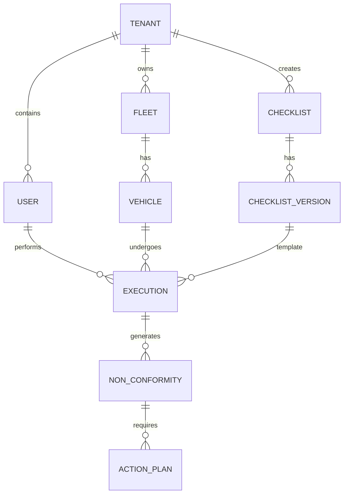

# FASE 0: PLANEJAMENTO E ARQUITETURA — CHECK-ON SAAS

Este documento consolida as definições arquiteturais, fluxo de dados e estratégias de engenharia para a plataforma CHECK-ON, cumprindo as diretrizes rigorosas de Multi-Tenant, Offline-First e integridade de dados exigidas pelo produto.

---

## 1. ARQUITETURA PROPOSTA
A arquitetura baseia-se em um modelo de microsserviços modulares (Modular Monolith inicialmente para reduzir complexidade de infraestrutura, com separação estrita de domínios) utilizando comunicação REST/GraphQL.
- **Frontend Web (Painel de Gestão):** Next.js (App Router), SSR/SSG para performance, autenticação via cookies HttpOnly.
- **Frontend Mobile (App Operacional):** Flutter, com repositório local robusto (SQLite/Isar) para Offline-First, operando independentemente de rede contínua.
- **Backend (API):** Node.js com NestJS, focado em Domain-Driven Design (DDD) e injeção de dependências.
- **Camada de Dados:** PostgreSQL para dados relacionais, estruturado para escalabilidade multiempresa. Redis para filas de processamento assíncrono (fotos, sync, relatórios).

## 2. ESTRUTURA DE DIRETÓRIOS (MONOREPO SUGERIDO)
```text
check-on-workspace/
├── apps/
│   ├── web/                # Next.js (Admin/Gestão)
│   ├── mobile/             # Flutter (App Operacional)
│   └── api/                # NestJS (Backend Multi-Tenant)
├── packages/
│   ├── shared-types/       # Interfaces e contratos DTOs (TypeScript)
│   ├── ui-kit/             # Componentes visuais React reaproveitáveis
│   └── eslint-config/      # Padronização de código
└── docker-compose.yml      # Orquestração local (PG, Redis, API)
```

## 3. TECNOLOGIAS E STACK
- **Mobile:** Flutter, Dart, SQLite (sqflite) ou Isar Database.
- **Web:** Next.js 14/15, React, Tailwind CSS, Shadcn UI, React Query.
- **Backend:** NestJS, TypeScript, Prisma ORM ou TypeORM, BullMQ (Filas).
- **Banco de Dados:** PostgreSQL 16+.
- **Cache/Background Jobs:** Redis.
- **Storage:** MinIO (para ambiente local/híbrido) + AWS S3 (Produção).
- **Testes:** Jest (Backend), Cypress/Playwright (E2E Web), Flutter Test.

## 4. MODELO MULTI-TENANT
Utilizaremos a abordagem **Row-Level Tenancy (Identificador de Coluna)** por ser mais econômica e escalar bem no início, apoiada por **Row-Level Security (RLS)** nativo do PostgreSQL.
- Toda tabela (exceto tabelas de sistema globais) possuirá a coluna `tenant_id`.
- O JWT de autenticação carregará o `tenant_id`.
- O backend injetará o `tenant_id` no contexto da requisição. Consultas que não passarem o `tenant_id` falharão na barreira do Prisma/NestJS, impedindo vazamento de dados (Cross-Tenant Data Leak).

## 5. MODELO RBAC (ROLE-BASED ACCESS CONTROL)
- **Roles:** Super Admin, Admin da Empresa, Gestor, Supervisor, Técnico SST, Motorista.
- **Permissions:** Granulares (ex: `checklist:create`, `vehicle:read`, `nc:close`).
- Uma Role é um conjunto de Permissions. O Motorista possui um JWT com escopo estrito apenas para operações operacionais e sincronização.

## 6. DIAGRAMA CONCEITUAL DO BANCO (Resumo)


## 7. PRINCIPAIS ENTIDADES
- `Tenant` (Empresas Clientes)
- `User` / `Employee`
- `Vehicle`, `Fleet`
- `Checklist`, `ChecklistVersion`, `ChecklistSection`, `ChecklistItem`
- `Execution`, `ExecutionAnswer`
- `NonConformity`, `ActionPlan`
- `AuditLog`

## 8. RELACIONAMENTOS CRÍTICOS
- **Imutabilidade do Checklist:** Uma `Execution` aponta para `ChecklistVersion` (nunca para `Checklist` raiz). Se o gestor alterar perguntas, gera uma v2. A execução v1 preserva as perguntas exatas daquele momento.
- **Rastreabilidade da NC:** A NC liga-se ao `Vehicle`, à `Execution` que a originou e ao `ChecklistItem` específico.

## 9. ESTRATÉGIA OFFLINE-FIRST (MOBILE)
1. Durante login com internet, o App baixa `ChecklistVersions` ativos, `Vehicles` permitidos, `NonConformities` abertas desses veículos.
2. Todo input é gravado primeiramente no SQLite local.
3. Se sem rede, o App opera normalmente lendo/escrevendo no banco local.
4. Uma tabela `SyncQueue` registra cada mutação (ex: `CREATE_EXECUTION`, `CREATE_NC`).

## 10. ESTRATÉGIA DE SINCRONIZAÇÃO
- **Background Worker:** Um Isolate no Flutter roda periodicamente escutando mudanças na conectividade.
- **Batch Processing:** Envia mutações agrupadas para economizar bateria e rede.
- **Resolução Server-Side:** O servidor é a fonte da verdade. O servidor recebe as mutações, valida assinaturas temporais e insere no PG.

## 11. CONFLITOS
- **Last-Write-Wins restrito:** Para edições comuns.
- **Proibição de Sobrescrita Crítica:** Uma NC fechada na nuvem não pode ser reaberta por um sync atrasado de um celular que estava offline (validação de estado atual no backend).

## 12. IDEMPOTÊNCIA
- Todo registro criado offline recebe um `uuid` (UUIDv4) no próprio celular (`client_id`).
- O servidor valida `client_id` como `UNIQUE`. Se o celular tentar reenviar o mesmo checklist por erro de rede (onde a requisição chegou, mas a resposta de sucesso caiu), o banco rejeitará o duplicado, e a API retornará `200 OK` avisando o celular que já foi processado.

## 13. ARMAZENAMENTO LOCAL (NAS / HD DA EMPRESA)
O backend conterá um `StorageService` interfaceado. Se o tenant optar por Local Storage, o backend salva arquivos no disco do servidor e serve via endpoints protegidos.

## 14. ARMAZENAMENTO CLOUD
Implementação S3 API-compatible. Os links armazenados no banco não conterão o domínio fixo, apenas um path relacional (ex: `s3://tenant-uuid/ncs/foto1.jpg`). O backend resolve em URLs assinadas (Pre-Signed URLs) expiráveis para exibição.

## 15. ARMAZENAMENTO HÍBRIDO
Arquivos recentes no HD local (cache quente), arquivos antigos arquivados na Nuvem (S3 Glacier/IA), reduzindo custos.

## 16. COMPRESSÃO DE FOTOS
- **Mobile:** Antes de ir para a `SyncQueue`, a imagem é redimensionada (ex: max 1920x1080), compressão WebP/JPEG (ex: 70%), com remoção de EXIF desnecessário, retendo apenas Geotag e Timestamp se exigido.
- **Backend:** Validação de MIME. Geração de Thumbnail de 200x200 enviada para background worker (Redis+BullMQ).

## 17. BACKUP
- **Database:** `pg_dump` diário assíncrono salvo em S3 de backup.
- **Point-in-Time Recovery (PITR):** Ativado no PostgreSQL gerencial em produção.

## 18. FLUXO DO CHECKLIST
`Criação` -> `Publicação (V1)` -> `Sync Mobile` -> `Motorista Seleciona Veículo` -> `Responde Perguntas` -> `Finaliza Local` -> `Sync para Servidor` -> `Disponível em Relatórios`.

## 19. FLUXO DA NÃO CONFORMIDADE (NC)
`Resposta Inválida no Checklist` -> `Gera NC Automática (Aberta)` -> `Notifica Técnico SST` -> `Análise` -> `Vincula Plano de Ação`.

## 20. FLUXO DO PLANO DE AÇÃO
`NC Em Análise` -> `Plano Criado` -> `Atribuído a (Mecânico/Supervisor)` -> `Prazo Estipulado` -> `Execução` -> `Foto de Evidência Submetida` -> `Supervisor Valida` -> `NC Encerrada`.

## 21. FLUXO MOTORISTA A -> MOTORISTA B (REINCIDÊNCIA)
- **Motorista A:** Relata Pneu Careca -> NC Crítica Aberta.
- **Motorista B:** Escaneia o QR Code do mesmo veículo.
- **App (antes de abrir checklist):** Carrega `NCs Abertas`. Exibe "Alerta: Pneu Careca (Em Tratamento)". Motorista B assina ciente. Sistema preenche a pergunta automaticamente ou agrupa a constatação sob a NC original, sem poluir o banco com NCs idênticas diárias.

## 22. NOTIFICAÇÕES
- **App:** Push notifications (Firebase Cloud Messaging).
- **Web:** WebSockets (Socket.io/NestJS Gateway) para atualizações em tempo real no Dashboard.

## 23. AUDITORIA
Tabela `AuditLogs` ou extensão `pgaudit`. Todo POST/PUT/DELETE em rotas sensíveis (Checklist, Empresa, NC, Plano) gerará log contendo: `user_id`, `tenant_id`, `action`, `table`, `old_value` (JSONB), `new_value` (JSONB).

## 24. SEGURANÇA
- Rate limiting global e estrito no Login/Sync.
- Senhas cacheadas via Bcrypt/Argon2.
- JWT acessos de curta duração + Refresh Token rotativo (HTTPOnly Cookie para Web).
- Bloqueio de injeções e sanitização rigorosa via `class-validator` (NestJS).

## 25. LGPD
Mapeamento e minimização de dados. A tabela `Employee` não guardará dados civis além do necessário (matrícula, nome, função, contato). A política de exclusão (Soft Delete vs Hard Delete) respeitará retenção legal de laudos de SST.

## 26. ESTRATÉGIA DE TESTES
- **Backend:** Testes Unitários (serviços) e Integração (Prisma) usando TestContainers (PG limpo por ciclo).
- **Flutter:** Testes de Unidade no Sync Engine; Widget Tests nas telas principais.
- **Web:** E2E em fluxos principais (Criar Checklist, Aprovar Plano de Ação).

## 27. CI/CD
- **GitHub Actions:** Pipeline ativada em PR. Roda Lint, Typecheck e Unit Tests.
- **Build Web & API:** Dockerização enviada para Container Registry, implantada via Webhook em ambiente Staging.
- **Build Mobile:** Fastlane para compilar APK/AAB e exportar artifacts para testes manuais.

## 28. ROADMAP INICIAL (FASES IMEDIATAS)
1. **Fase 1:** Configuração do Monorepo, infra Docker (PG+Redis), NestJS Base (Auth/Tenant), e Estrutura do BD.
2. **Fase 2:** CRUD de Empresas, Unidades, Usuários (RBAC) no painel Web.
3. **Fase 3:** Gestão de Frotas e Veículos no painel Web.
4. **Fase 4:** Motor de Criação de Checklist (Checklist Builder - Web).
5. **Fase 5:** MVP do Aplicativo Flutter (Login, Seleção de Veículo, Sincronização Local).

## 29. CRITÉRIOS DE ACEITE DA FASE 1
- Estrutura de diretórios versionada e testável (`npm run test` com sucesso).
- Banco de Dados inicializado com as tabelas de Auth e Tenancy.
- Endpoints de Autenticação gerando e validando JWT.
- Contexto de Tenancy barrando requisições cross-tenant.
- Health Check APIs para Banco e Redis retornando `200 OK`.

## 30. RISCOS TÉCNICOS IDENTIFICADOS
- **Sync Engine Complexidade:** Evitar perda de dados exige algoritmos resilientes para edge-cases em conexão intermitente (resolução via `idempotency keys`).
- **Overhead de Versionamento de Checklists:** Tabelas relacionais aninhadas podem degradar performance de leitura. (Atenuação: cacheamento JSONB da estrutura ativa, consultas baseadas em snapshot).
- **Armazenamento de Imagens:** Crescimento rápido do volume. (Atenuação: compressão pesada via mobile pré-upload).

---
**STATUS:** Arquitetura definida e documentada. Aguardando aprovação para prosseguir com a Fase 1 (Fundação).
